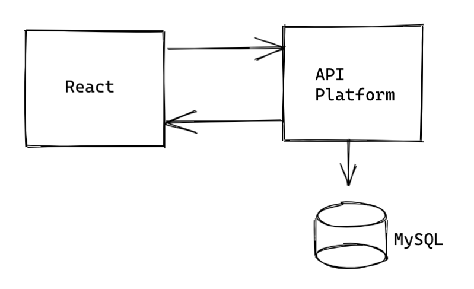

# Refactoring session 1

Je travaille depuis quelques temps sur une petite appli de gestion d'entrainement de fitness.
Une application très simple afin d'approcher les contraintes de conception autour de React.

### Objectif de l'expérience

- Negociation d'auth JWT & React
- Update React Hook
- Update React 17
- Redux : Avec ou sans
- State management
- RAD API -> API Platform sélectionné

## Architecture
L'architecture technique est très simple.
Frontend : Stack React(avec tooling)
Backoffice : API Platform
Base de donnée: mariadb
 

### Technique

- Sessions utilisateurs : Géré par API Platform. Connexion a l'API via token JWT, modification du [helper] pour adapter la récupération des données de l'utilisateur.
- CRUD entité : API Platform natif avec utilisation des filters/oppérations et groupes d'accès
- Interface de login : React / JWT
- API Front : React / axios basée sur les paterns Promises ES6
- Ecrans d'informations : React / Datatable / ChartJs2
- Formulaire de saisies : React / react-form

## Etat instant T

 

- Actions : contient les actions utilisés dans les reducers
- API : interfaces vers l'API Backend
- Components : composants grahique
- Containers : Construction d'interface complexes (s'appuyant en partie sur les components cf. au dessus)
- Store : Construction store / reducer pour redux
- styles : style basique de l'app

### Chantier
- Couverture de tests `store`
-
- Dossier actions a décomissionner
- PropsType sur tous les composants / containers
- Séparration componnent / containers

## Resources
- https://medium.com/better-programming/understanding-the-useeffect-dependency-array-2913da504c44